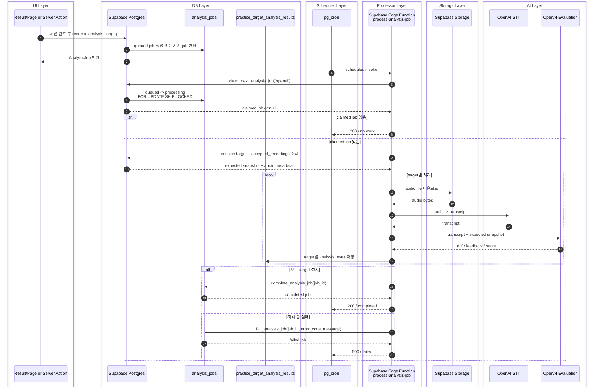

# echo

## Analysis Processor Flow

Supabase 배포, secret 설정, pg_cron 등록, OpenAI quota 대응 절차는 [Analysis Processor Supabase 운영 가이드](./docs/operations/analysis-processor-supabase.md)를 참고합니다.

```mermaid
sequenceDiagram
  autonumber

  box UI Layer
    participant UI as Result/Page or Server Action
  end

  box DB Layer
    participant DB as Supabase Postgres
    participant Jobs as analysis_jobs
    participant Results as practice_target_analysis_results
  end

  box Scheduler Layer
    participant Cron as pg_cron
  end

  box Processor Layer
    participant Fn as Supabase Edge Function<br/>process-analysis-job
  end

  box Storage Layer
    participant Storage as Supabase Storage
  end

  box AI Layer
    participant STT as OpenAI STT
    participant Eval as OpenAI Evaluation
  end

  UI->>DB: 세션 완료 후 request_analysis_job(...)
  DB->>Jobs: queued job 생성 또는 기존 job 반환
  DB-->>UI: AnalysisJob 반환

  Cron->>Fn: scheduled invoke
  Fn->>DB: claim_next_analysis_job('openai')
  DB->>Jobs: queued -> processing<br/>FOR UPDATE SKIP LOCKED
  DB-->>Fn: claimed job or null

  alt claimed job 없음
    Fn-->>Cron: 200 / no work
  else claimed job 있음
    Fn->>DB: session target + accepted_recordings 조회
    DB-->>Fn: expected snapshot + audio metadata

    loop target별 처리
      Fn->>Storage: audio file 다운로드
      Storage-->>Fn: audio bytes

      Fn->>STT: audio -> transcript
      STT-->>Fn: transcript

      Fn->>Eval: transcript + expected snapshot
      Eval-->>Fn: diff / feedback / score

      Fn->>Results: target별 analysis result 저장
    end

    alt 모든 target 성공
      Fn->>Jobs: complete_analysis_job(job_id)
      Jobs-->>Fn: completed job
      Fn-->>Cron: 200 / completed
    else 처리 중 실패
      Fn->>Jobs: fail_analysis_job(job_id, error_code, message)
      Jobs-->>Fn: failed job
      Fn-->>Cron: 500 / failed
    end
  end
```
