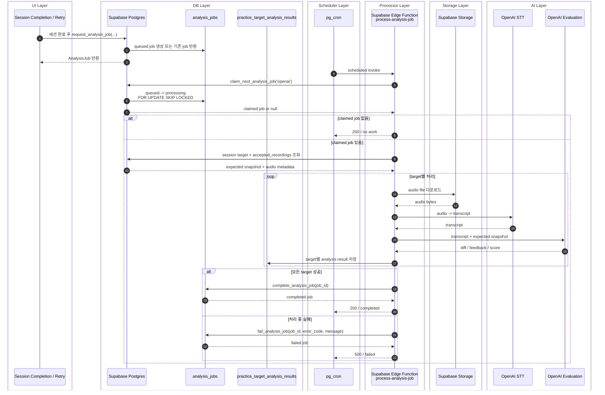

# Echo

사용자가 준비한 영어 자료로 대화를 연습하고, 문장을 암기하며, 어법을 분석·검토하는 영어 학습 서비스입니다. 자료 작성부터 연습, 녹음 확인, 피드백까지 하나의 흐름으로 연결합니다.

프론트엔드에서는 **사용자 이벤트에 따른 상태 변화, 업무 규칙의 책임, 실패 시 보존할 데이터**를 중심으로 설계합니다. Codex를 코드 탐색·구현·테스트에 활용하며, 요구조건과 설계 검토·결과 수용 기준은 직접 정하고 수정합니다.

**연습 흐름과 현재 범위**

| 모드      | 사용자 흐름                                                             | 현재 범위                                                                                     |
| --------- | ----------------------------------------------------------------------- | --------------------------------------------------------------------------------------------- |
| 롤플레잉  | 대본 작성 → 역할 선택 → 상대방 음성 듣기·녹음 → 문장별 저장 → 완료·분석 | 저장한 문장을 기준으로 이어하기, 완료 재시도, 분석 결과 조회                                  |
| 문단 암기 | 문단 작성·확정 → 연습 설정 → 녹음                                       | 편집·연습 UI가 있으며 실제 녹음 저장·완료·분석 전체 연결은 후속 과제                          |
| 어법 연습 | 문장·어법 설명 입력 → 사전 검사 → AI 분석 검토·편집 → 저장 → 암기·시험  | 작업 브랜치에서 라우트·저장·세션·피드백 구현 및 로컬 검증. 운영 환경 반영·실제 AI 검증은 별도 |

홈은 연습 모드를 선택하는 진입점으로 두고, 학습 기록과 녹음 관리는 마이페이지에서 제공합니다. 어법 기능의 상태는 [2026-10-06 구현·검증 기록](https://github.com/Yelihi/echo/blob/b192c485bfe16eea8063efc501a01e6212cc2511/docs/design/echo/grammar-practice-20261005/implementation-20261006.md)을 기준으로 합니다.

**프론트엔드 설계에서 다룬 문제**

1. **이벤트 처리의 책임을 어디에 둘 것인가**

   UI는 입력 수집·이벤트 연결·표현을 담당합니다. 검증·처리 순서·상태 전이는 기능의 업무 규칙으로 분리하고, DOM 포커스 같은 표현 동작은 UI에 둡니다. 비동기 오류는 책임 레이어에서 처리해 UI에 복구 가능한 계약을 전달하며, 내부 진단 정보는 로깅 경계에서 기록합니다.

   어법 편집에서는 편집 종류별 중앙 분기를 명시적인 서비스 메서드와 공통 검증·반영 흐름으로 나눴습니다. 분석 요청도 각 단계가 입력 검증을 소유하고 상위 함수는 실행 순서를 조정하도록 정리했습니다. [분석·편집 리뷰 기록](https://github.com/Yelihi/echo/blob/b192c485bfe16eea8063efc501a01e6212cc2511/docs/design/echo/grammar-practice-20261005/analysis-reading-review.md)

2. **한 번의 입력이 어느 영역을 갱신해야 하는가**

   상태는 필요한 가까운 위치에서 소유합니다. 대사 목록은 ID 목록, 개별 행은 자신의 데이터, 개수 표시는 파생된 개수만 구독합니다. 이벤트에서만 필요한 값은 이벤트 시점에 읽어 구독을 줄입니다.

   React Profiler와 실제 컴포넌트 렌더 호출을 측정해 대사 수정 시 다른 행 0회, 제목 변경 시 대사 행 0회, 모바일 메뉴 토글 시 주변 콘텐츠 0회를 확인했습니다. 함께 바뀌어야 하는 정보는 정상 갱신하며, 이 수치를 서비스 전체 속도 개선율로 해석하지 않습니다. [렌더링·회귀 검증 기록](./docs/design/echo/practice-hub-20261004/review-followup.md)

3. **실패하거나 화면을 떠났을 때 무엇을 보존해야 하는가**

   녹음 저장 실패 시 현재 화면의 오디오와 입력을 유지하고, 세션 재진입 시 서버에 확정된 녹음을 기준으로 복원합니다. 미저장 오디오는 메모리에만 있으므로 브라우저 종료 후 복원을 보장하지 않습니다.

   어법 기능은 취소 뒤 도착한 분석 응답을 반영하지 않고, 저장 충돌 시 초안을 유지합니다. 여러 편집은 전체 검증에 성공한 뒤 반영하며, 일부 실패로 중간 결과가 저장되지 않도록 합니다. [세션 이어하기](./docs/operations/session-resume.md) · [어법 구현 기록](https://github.com/Yelihi/echo/blob/b192c485bfe16eea8063efc501a01e6212cc2511/docs/design/echo/grammar-practice-20261005/implementation-20261006.md)

4. **공용 UI 변경을 기존 화면에 어떻게 안전하게 적용할 것인가**

   `interface/props 정의 → 독립 컴포넌트 → Storybook·유닛 검증 → 페이지 통합 → 회귀 확인` 순서로 변경합니다. 역할 기반 디자인 토큰을 사용하고 입력·오류·비활성 상태, 한글 조합, 키보드 조작, 포커스 복귀와 모션 감소 설정을 함께 확인합니다. [디자인 시스템과 변경 기준](./docs/design-system.md)

**구조와 기술 선택**

| 영역        | 기술과 역할                                                                         |
| ----------- | ----------------------------------------------------------------------------------- |
| 화면·라우팅 | Next.js App Router, React, TypeScript — 인증된 서버 조회와 클라이언트 상호작용 분리 |
| 상태·데이터 | Zustand — 편집·연습 상태와 세부 구독, TanStack Query — 클라이언트 비동기 조회·갱신  |
| UI          | Tailwind CSS, CVA, Radix UI — 역할 기반 토큰, variant, 공용 상호작용                |
| 외부 경계   | Zod — 입력·응답 검증, Supabase — 인증·Postgres·Storage·Edge Functions               |
| AI          | OpenAI — 음성 생성·전사·분석. 서버에서 권한과 이용 한도 확인                        |
| 검증        | Jest·Testing Library, Storybook·Vitest·Playwright, TypeScript, ESLint               |

```text
src/
  app/       라우트, 레이아웃, 인증 진입점과 페이지 연결
  views/     화면 조합, 화면별 조정과 ViewModel 변환
  widgets/   여러 화면에서 사용하는 셸·내비게이션·조회 조합
  features/  사용자 기능, 상태 전이, 요청·저장 흐름
  entities/  도메인 모델·규칙, repository 계약과 구현
  shared/    공용 UI, 외부 클라이언트, 로깅과 기반 도구
supabase/    DB 마이그레이션과 분석 worker
```

FSD 계층을 기반으로 표현·업무 규칙·외부 접근의 변경 이유를 구분합니다. 서버 전용 모듈에는 `server-only`를 사용하고, 녹음·분석의 주요 경계는 ESLint 규칙으로 검사합니다. [서비스·도메인 동작의 배치 기준](./docs/architecture/service-behavior-naming.md)

**AI와 협업하는 방식**

Codex에는 탐색·구현·테스트 초안을 맡기고, 다음 기준으로 결과를 검토합니다.

| 작업 중 확인한 문제                                    | 보완한 기준                                             |
| ------------------------------------------------------ | ------------------------------------------------------- |
| 디자인이 기존 컴포넌트의 테마 변경에 머무름            | 홈의 목적과 정보 우선순위를 다시 정의하고 시안을 재검토 |
| 이벤트 안에 업무 규칙이 남거나 중앙 함수의 책임이 커짐 | 상태·이벤트·interface와 책임 주체를 먼저 설명하고 수정  |
| 컴포넌트 분리만으로 성능 개선을 판단하기 어려움        | 실제 입력에 따른 렌더링 범위 측정                       |
| 정상 경로의 성공만으로 변경을 완료하기 어려움          | 저장 실패·취소·늦은 응답·기존 사용처를 검증 범위에 포함 |
| 새로운 코드 형식이 기존 관례와 어긋남                  | 기존 명명·경계를 우선하고 설명할 수 없는 변경은 재검토  |

세부 구현에는 AI가 제안한 해결책도 포함됩니다. 설계 의도와 테스트가 증명하는 범위를 확인한 뒤 결과를 수용하며, 실제 외부 서비스 검증과 mock 기반 검증을 구분합니다.

**로컬 실행**

CI와 같은 Node.js 22와 npm을 사용합니다.

```sh
npm ci
cp .env.example .env.local
```

`.env.local`에 개발용 Supabase의 `NEXT_PUBLIC_SUPABASE_URL`, `NEXT_PUBLIC_SUPABASE_PUBLISHABLE_KEY`를 설정합니다. 서버 저장·AI 기능에는 `SUPABASE_SERVICE_ROLE_KEY`, `OPENAI_API_KEY`와 해당 DB 마이그레이션이 필요합니다. Supabase의 Google OAuth 설정과 콜백 URL도 실행 환경에 맞춰야 합니다. 유료 AI 호출은 [AI 이용 권한·비용 제어](./docs/operations/ai-cost-controls.md)의 권한 설정을 따릅니다. CLI·배포용 값은 해당 작업을 수행할 때 설정합니다.

```sh
npm run dev
```

앱은 `http://localhost:3000`에서 확인합니다. 실제 OAuth·저장·AI 호출 없이 컴포넌트와 상호작용을 확인하려면 Storybook을 실행합니다.

```sh
npm run storybook
```

Storybook 주소는 `http://localhost:6006`입니다. 로컬 DB가 필요한 검증은 Docker 실행 후 `npm run supabase:start`로 준비하며, 분석 worker 배포·secret·스케줄러 설정은 [Supabase 운영 가이드](./docs/operations/analysis-processor-supabase.md)를 따릅니다.

**검증**

```sh
npm run typecheck
npm run lint
npm test -- --runInBand
npm run build
```

Storybook 상호작용 검증은 Playwright Chromium 설치 후 실행합니다.

```sh
npx playwright install chromium
npm run test:storybook
```

2026-10-06 어법 작업의 [검증 기록](https://github.com/Yelihi/echo/blob/b192c485bfe16eea8063efc501a01e6212cc2511/docs/design/echo/grammar-practice-20261005/implementation-20261006.md)에는 Jest 150 suites·647 tests, Storybook 87 files·325 tests와 타입 검사·변경 파일 린트·Next.js 빌드 통과가 남아 있습니다. 이는 해당 작업 시점의 기록입니다. CI는 포맷·린트·타입·Jest·빌드를 실행하며 Storybook 검증은 별도 명령입니다.

브라우저 검증은 실제 컴포넌트의 선택·입력·저장 실패·모바일 화면을 포함하지만 유료 서버 동작은 mock으로 대체했습니다. 어법 SQL의 PGlite 검증은 실제 Supabase 환경과 동시 트랜잭션 부하 검증을 대체하지 않습니다. 녹음·분석의 추가 확인 항목은 [녹음 리팩터링 검증](./docs/operations/recording-refactor-verification.md)에 정리되어 있습니다.

**녹음 분석 처리 흐름**

녹음 세션 완료 후 분석 작업을 요청하고, 별도 worker가 음성을 전사·평가합니다. 결과 페이지의 조회는 새 분석 작업을 생성하지 않습니다. 배포·secret·pg_cron·quota 대응은 [분석 processor 운영 가이드](./docs/operations/analysis-processor-supabase.md), 호출 제한과 결과 재사용은 [AI 비용 제어](./docs/operations/ai-cost-controls.md)를 참고합니다.

<details>
<summary>분석 작업의 요청·처리·결과 저장 순서</summary>



</details>
