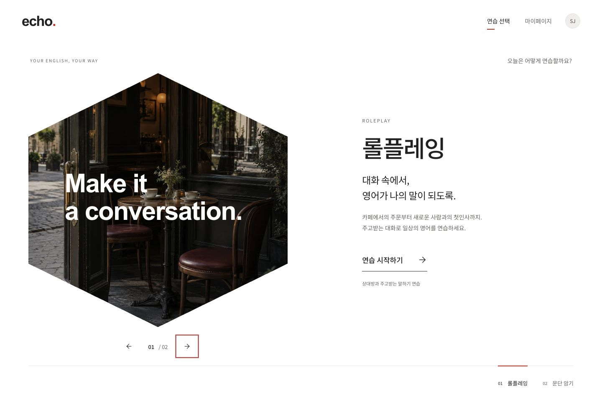

# Echo

**내가 익히고 싶은 영어를, 직접 말하고 다시 들어보는 연습.**

Echo는 사용자가 준비한 대본과 문장으로 영어를 연습하는 개인 프로젝트입니다. 상대방의 대사를 듣고 내 역할을 녹음한 뒤, 원문과 전사문을 비교하고 피드백을 확인합니다. 연습 중 끊기거나 저장에 실패해도 이미 끝낸 작업을 반복하지 않도록 만드는 데 집중했습니다.

**[서비스 바로가기](https://echo-navy-iota.vercel.app)** · [녹음·분석 코드](./src/views/recording/services/hooks/useRoleplayRecordingController.ts) · [설계·검증 문서](./docs/portfolio/verification.md)

Google 로그인을 사용합니다. 음성 생성과 분석은 이용 권한이 부여된 계정에서 사용할 수 있습니다. 배포 주소는 2026-10-08 로그인 화면 응답을 확인했습니다.

<details>
<summary>화면 미리보기 — 연습 모드를 고르는 홈</summary>



2026-10-04 실제 컴포넌트 통합 화면의 검증 기록입니다.

</details>

**프로젝트에서 맡은 일**

사용자 흐름과 화면 구성을 정하고, 컴포넌트·상태의 책임을 나눴습니다. Next.js에서 인증·조회·저장 경계를 설계하고, 브라우저 녹음부터 파일 저장, 세션 완료, 비동기 분석까지 연결했습니다. 특히 정상 동작 이후에 남는 문제인 중복 요청, 응답 유실, 화면 이탈, 부분 실패를 검토하고 수정했습니다.

**현재 제공하는 흐름**

| 기능      | 흐름                                                                    | 구현 범위                                                         |
| --------- | ----------------------------------------------------------------------- | ----------------------------------------------------------------- |
| 롤플레잉  | 대본 작성 → 역할 선택 → 상대방 음성 → 내 대사 녹음 → 문장별 저장 → 분석 | 저장·이어하기·완료·분석 결과 조회 연결                            |
| 문단 암기 | 문단 작성·확정 → 연습 설정 → 녹음                                       | 편집·연습 UI 구현. 녹음 저장부터 분석까지의 전체 연결은 후속 과제 |
| 어법 연습 | 문장·어법 설명 → 분석 검토·편집 → 저장 → 암기·시험                      | 입력·저장·목록·암기·시험·기록 연결. 운영 DB·실제 AI 검증은 별도   |

**실제 아키텍처**


웹 앱은 Vercel의 Next.js에서 실행하고, 인증·관계형 데이터·녹음 파일은 Supabase를 사용합니다. 녹음 분석은 Postgres의 `analysis_jobs`와 `pg_cron`, Edge Function으로 분리했습니다. 화면의 요청이 끝나도 분석 작업과 결과가 DB에 남습니다.

도표는 배포 기준 코드 `f5bef12`의 녹음·분석 경로를 Archify로 작성했습니다. 상대방 음성 생성은 Next.js의 Server Action에서 OpenAI TTS를 호출하는 별도 경로입니다. [인터랙티브 아키텍처 HTML](./docs/portfolio/architecture.html)은 내려받아 브라우저에서 열 수 있으며, 노드에서 근거 코드로 이동할 수 있습니다.

```text
src/
  app/       라우트·레이아웃, 인증 진입점, API Route Handler
  views/     화면 조합, 화면별 상태·이벤트 조정, ViewModel 변환
  widgets/   앱 셸·내비게이션과 여러 화면에서 쓰는 조합
  features/  녹음·저장 등 사용자 기능과 요청 흐름
  entities/  도메인 모델·규칙, repository 계약과 구현
  shared/    공용 UI, AudioCapture, 외부 클라이언트·로깅
supabase/
  migrations/  소유권·저장 순서·완료 조건·작업 선점을 보장하는 SQL
  functions/   음성 전사·평가·결과 저장 worker
```

FSD 계층 안에서도 파일의 길이보다 변경 이유를 기준으로 책임을 나눴습니다. 녹음 장치의 수명은 `AudioCapture`, 녹음 상태는 reducer, 대화 진행은 세션 store, 저장은 서버 서비스가 담당합니다. 서버 전용 코드는 `server-only`로 구분하고 주요 녹음·분석 경계는 ESLint로 검사합니다.

**기술을 선택하고 적용한 이유**

| 선택                                        | 해결하려던 문제와 적용 방식                                                                                                        | 함께 고려한 점                                                                    |
| ------------------------------------------- | ---------------------------------------------------------------------------------------------------------------------------------- | --------------------------------------------------------------------------------- |
| Next.js App Router · React · TypeScript     | 인증된 조회와 브라우저 상호작용을 한 앱 안에서 나누기 위해 사용. Server Component는 조회·조합, Client Component는 편집·녹음을 담당 | 저장 진입점에서도 인증을 다시 확인. 서버 조회 결과와 로컬 편집 상태의 수명을 구분 |
| Server Action + Route Handler               | 자료 저장·세션 생성은 Server Action, 녹음 파일은 `FormData`를 받는 `/api/roleplay-recordings`로 처리                               | 화면이 DB·Storage 세부 API를 직접 조정하지 않도록 서버에 저장 책임을 둠           |
| Zustand + React reducer                     | 편집기의 행별 구독과 여러 UI가 공유하는 연습 상태는 Zustand, 녹음 자체의 상태 전이는 reducer로 관리                                | 모든 값을 전역화하지 않고 메뉴 등 일시적인 상태는 해당 컴포넌트에 유지            |
| Supabase Auth · Postgres · Storage          | 로그인·소유권·관계형 학습 기록·오디오 저장을 구성하고, 저장 순서와 완료 조건을 DB에서도 검사                                       | 파일 업로드와 DB 트랜잭션은 원자적이지 않으므로 재시도·응답 유실을 별도로 처리    |
| Postgres 작업 큐 + pg_cron · Edge Functions | 음성 전사와 평가를 웹 요청 수명에서 분리하고 기존 DB로 작업 상태·재처리를 관리                                                     | 작업 선점·오래된 실행 차단이 필요하며 cron 주기에 따른 시작 대기가 있음           |
| Tailwind CSS · CVA · Radix UI               | 역할 기반 토큰과 variant로 화면 간 일관성을 유지하고, 다이얼로그·메뉴의 공통 동작을 재사용                                         | 스타일 변경 시 한글 입력·키보드·포커스·기존 props 계약을 함께 확인                |
| Jest · Testing Library · Storybook/Vitest   | 순수 상태 전이와 실제 컴포넌트 상호작용을 나눠 검증                                                                                | 외부 API mock 테스트와 실제 마이크·DB·유료 분석 확인은 구분                       |

**핵심 흐름 1 — 녹음 시작과 저장**


1. 연습 시작 시 대본·역할·음성·평가 모드를 세션 스냅샷으로 저장합니다. 이후 원본 대본이 바뀌어도 진행 중인 연습의 기준은 유지됩니다.
2. 내 차례가 되면 `getUserMedia`로 마이크 권한을 요청하고, `MediaRecorder.isTypeSupported`로 지원 형식을 골라 녹음합니다. 중지 시 최종 데이터 이벤트를 기다려 Blob을 만들고 마이크 트랙을 해제합니다.
3. 저장 요청은 Blob과 `recordingId`를 전송합니다. 서버는 인증·Origin·세션 소유권·대상 문장·파일 크기·MIME을 확인한 뒤 Storage에 업로드합니다.
4. `commit_roleplay_recording` RPC가 세션 행을 잠그고, 다음에 저장할 학습자 문장과 업로드된 오브젝트를 확인합니다. 녹음 확정과 진행 위치 변경은 같은 DB 트랜잭션에서 처리합니다.
5. 성공 응답 뒤에만 클라이언트의 Blob을 해제하고 다음 문장으로 이동합니다. 실패하면 오디오를 유지해 다시 듣거나 저장을 재시도할 수 있습니다.

[녹음 장치 제어](./src/shared/lib/audio/AudioCapture.ts) · [화면의 녹음·저장 조정](./src/views/recording/services/hooks/useRecordingTurn.ts) · [서버 저장](./src/features/recording-storage/services/server/saveLearnerRecording.ts) · [저장·완료 RPC](./supabase/migrations/20260910120000_roleplay_recording_completion.sql) · [시퀀스 HTML](./docs/portfolio/recording.html)

**핵심 흐름 2 — 세션 완료와 분석**


1. 마지막 녹음과 필요한 상대방 발화를 마친 뒤 완료를 요청합니다. `finish_roleplay_recording`은 필수 녹음이 모두 있는지 확인하고, 세션 완료와 분석 작업 생성을 같은 트랜잭션에서 처리합니다.
2. `pg_cron`이 분석 함수를 호출하면 `FOR UPDATE SKIP LOCKED`로 작업 하나를 선점합니다. 선점할 때마다 새 `claim_token`을 발급합니다.
3. worker는 아직 처리하지 않은 문장을 최대 3개씩 처리합니다. 오디오를 내려받고 재사용 가능한 결과가 있는지 확인한 뒤, 필요한 경우 음성 전사 → 텍스트 평가 → 문장별 결과 저장을 실행합니다.
4. 한 묶음의 모든 처리가 끝난 뒤, 남은 문장이 있으면 작업을 다시 대기 상태로 돌리고 모두 처리했으면 완료합니다. 일부 실패가 발생하면 성공한 문장의 결과를 남긴 채 작업을 실패 상태로 전환합니다.
5. 결과 화면은 저장된 작업 상태와 결과를 조회합니다. 조회 자체가 새 분석을 시작하지 않으며, 진행 중인 분석은 주기적으로 다시 조회합니다.

[배치 처리](./supabase/functions/process-analysis-job/processClaimedJob.ts) · [선점 토큰 검증](./supabase/migrations/20260910090000_analysis_claim_fencing.sql) · [읽기 전용 결과 조회](./src/views/analysis-result/services/server/loadSessionAnalysis.ts) · [시퀀스 HTML](./docs/portfolio/analysis.html)

도표는 정상 경로를 중심으로 표시했습니다. 실제 처리는 작업 없음, 이용 권한 없음, 공급자 오류, 결과 재사용과 부분 실패 경로를 함께 다룹니다. exact 모드의 원문·전사문 차이는 코드로 계산하고, context 모드는 표현 차이보다 의미를 기준으로 평가하도록 구분했습니다.

**구현하면서 가장 많이 고민한 부분**

**저장 버튼을 다시 누르면 같은 녹음이 두 번 생기지 않을까?**

버튼 비활성화만으로는 서버 저장 후 응답이 유실되는 상황을 해결할 수 없었습니다. 같은 Blob에는 `WeakMap<Blob, string>`으로 같은 녹음 ID를 부여하고, 서버에서는 ID·문장·오디오 SHA-256이 포함된 오브젝트 경로를 비교합니다. 이미 확정된 동일 요청은 성공으로 반환하고, 같은 ID에 다른 내용이 오면 충돌로 처리합니다.

Storage 업로드와 DB 저장은 별개의 작업입니다. DB 확정에서 오류를 받았다고 파일을 바로 지우면, 실제 저장은 끝났지만 응답만 유실된 녹음까지 삭제할 수 있습니다. 그래서 오류 응답만으로 파일을 삭제하지 않고 같은 요청으로 재시도할 수 있게 했습니다. 이 선택에는 확정되지 않은 오브젝트가 남을 수 있다는 비용이 있으며, 파일 정리는 별도의 책임으로 다룹니다.

**녹음 저장은 성공했는데 세션 완료가 실패하면 다시 녹음해야 할까?**

문장 저장과 세션 완료를 별도 상태로 관리했습니다. 마지막 문장이 저장됐다면 완료 요청이 실패해도 재녹음을 요구하지 않고 `완료 확인`에서 완료 처리만 재시도합니다. 화면에 돌아왔을 때는 서버에 확정된 문장 중 첫 미저장 위치를 찾아 이어갑니다. 뒤로가기로 캐시된 화면에 복귀하는 경우에도 서버 상태를 다시 읽습니다.

**마이크 권한 창과 음성 재생이 화면보다 늦게 끝나면 어떻게 할까?**

마이크 권한 요청은 화면을 떠난 뒤에 끝날 수 있습니다. 녹음 시작마다 token을 두고 취소·언마운트 시 무효화해, 늦게 완료된 시작 요청의 장치를 정리합니다. 상대방 음성도 재생 요청 ID를 비교해 이전 응답과 종료 이벤트가 다음 차례를 바꾸지 않도록 했습니다. 사용자 입력에서 오디오 재생을 준비하고, 자동 재생이 거부되면 직접 재생할 수 있는 상태를 제공합니다.

**분석 하나가 실패했을 때 다른 문장의 저장은 어떻게 될까?**

`Promise.all`은 하나가 실패해도 나머지 작업을 취소하지 않습니다. 작업을 먼저 실패 처리하면 아직 실행 중인 문장들이 뒤늦게 저장을 시도할 수 있어, `Promise.allSettled`로 해당 묶음이 모두 끝난 뒤 작업 상태를 전환했습니다. worker가 작업을 다시 가져간 경우에는 `claim_token`이 달라지므로 이전 worker의 결과 저장과 완료 요청을 DB에서 거부합니다.

실패한 분석을 재시도할 때는 사용자·세션·원문 스냅샷·오디오 해시·평가 모드·모델·분석 코드 버전이 같은 결과만 재사용합니다. 다만 공급자 호출 성공 후 DB 저장 전에 응답이 유실되면 재과금 가능성은 남습니다.

**프론트엔드에서 지킨 기준**

- **구독은 실제로 바뀌는 단위에 맞췄습니다.** 대사 목록은 ID 배열, 행은 자신의 데이터, 개수 표시는 개수만 구독합니다. 이벤트에서만 필요한 값은 `getState()`로 읽습니다. Profiler와 실제 렌더 호출 측정에서 대사 수정 시 다른 행 0회, 제목 변경 시 대사 행 0회를 확인했습니다. [측정 기록](./docs/design/echo/practice-hub-20261004/review-followup.md)
- **홈과 연습 화면의 목적을 나눴습니다.** 홈에서는 연습 모드 선택에 집중하고 기록·관리는 마이페이지로 옮겼습니다. 직접 진입이나 새로고침으로 방문 이력이 없어도 돌아갈 상위 화면을 정했습니다.
- **사용자가 들인 입력을 보호했습니다.** 미저장 입력·녹음이 있으면 이탈을 확인하고, 저장 중에는 중복 동작과 이탈을 제어합니다. 미저장 오디오는 메모리에만 있어 브라우저 종료 후 복원되지는 않습니다.
- **공용 UI는 따로 확인한 뒤 연결했습니다.** props·이벤트 정의 → 독립 Storybook·유닛 검증 → 실제 화면 통합 순서로 작업했습니다. 한글 조합·키보드·포커스 복귀·오류 상태·모션 감소와 390px 화면을 확인했습니다. [디자인 시스템](./docs/design-system.md)

어법 화면은 제목·설명·레이아웃을 서버에서 조합하고, 편집·회상 입력은 클라이언트 영역에 둡니다. 저장·취소 뒤의 이동은 `app` 라우트가 담당합니다. 회상 연습은 세션 상태와 문항별 입력의 수명을 나눠 문항 전환 시 답안을 유지하고, 다른 세션을 열 때 이전 입력이 섞이지 않도록 했습니다.

**검증과 남은 범위**

테스트는 파일 수보다 실패 이후의 동작을 확인하는 데 사용했습니다. 녹음 권한 요청 중 취소, 저장 중복·실패, 완료 재시도, 마지막 상대방 발화, 오디오 해제, 부분 분석 실패와 오래된 worker의 쓰기 차단이 주요 검증 대상입니다.

[홈·편집기 통합 검증](./docs/design/echo/practice-hub-20261004/review-followup.md)에는 Jest 120 suites·406 tests, Storybook 73 files·290 tests 및 타입·린트·빌드 통과가 기록돼 있습니다. 해당 작업 시점의 결과이며, 이번 README 변경에서 제품 테스트를 새로 실행한 것은 아닙니다.

- 실제 계정·마이크·유료 분석의 전체 E2E와 브라우저별 장치 호환성은 별도 확인 범위입니다.
- 문단 암기의 저장·완료·분석 전체 연결은 미완료입니다.
- 어법 기능은 [별도 구현·검증 기록](./docs/design/echo/grammar-practice-20261005/implementation-20261006.md)에서 다룹니다. 운영 DB·실제 AI 검증과 로컬 검증을 구분합니다.

**로컬 실행**

Node.js 22와 npm을 사용합니다.

```sh
npm ci
cp .env.example .env.local
```

개발용 Supabase의 URL·publishable key를 설정합니다. 서버 저장·음성·분석에는 service-role key·OpenAI key, 해당 DB 마이그레이션과 이용 권한이 필요합니다. Google OAuth의 callback도 실행 주소에 맞춥니다. 자세한 설정은 [Supabase 운영 가이드](./docs/operations/analysis-processor-supabase.md)와 [AI 이용 권한·비용 제어](./docs/operations/ai-cost-controls.md)를 참고합니다.

```sh
npm run dev                 # 앱: localhost:3000
npm run storybook           # 컴포넌트: localhost:6006
npm test -- --runInBand
npm run typecheck
npm run lint
npm run build
```

Storybook 상호작용 테스트는 `npx playwright install chromium` 후 `npm run test:storybook`으로 실행합니다. 로컬 DB 검증은 Docker와 로컬 Supabase가 필요하며 [녹음 검증 가이드](./docs/operations/recording-refactor-verification.md)에 실행 방법과 확인 범위를 기록했습니다.
