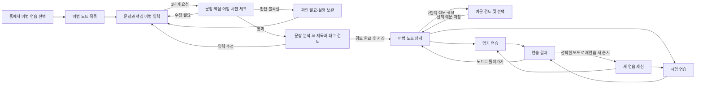
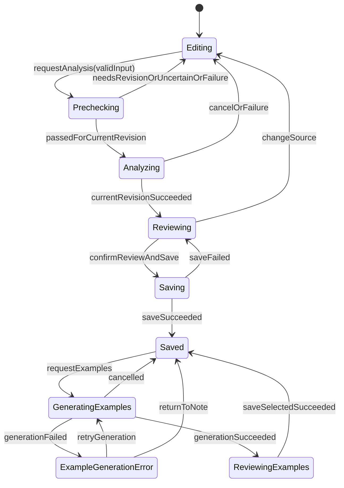

# Echo 어법 연습 화면 설계 초안

2026-10-05. 사용자가 이미 배운 어법을 문장으로 기록하고, 분석을 확인한 뒤 여러 예문으로 반복 연습하는 흐름을 설계한다. 사용자는 2026-10-05 이 계획의 이슈별 구현과 PR 생성을 승인했다. 구현 완료를 의미하지 않는다. 기존 롤플레잉·문단 암기와 동일한 Echo 디자인을 사용한다. 자유 토킹은 AI tutor 개발 이후 범위다.

## 2026-10-05 사용자 피드백 반영 상태

확정 요구: 제목·태그는 사용자 입력 없이 AI 생성, 영어 문장·핵심 어법 설명 필수, 사전 체크 후 분석하는 1단계와 예문 생성 2단계, 생성 실패 시 다시 생성 버튼, 목록 페이지네이션·스켈레톤, 저장한 기준 문장 발음 재생, 재연습 순서 무작위 변경, 완료 누적 횟수와 연습 날짜, 시험 완료 후 답안별 피드백, 기능 이벤트의 features 모듈화.

최종 승인: 분석 풀이를 문장 아래에 표시, 수정안의 연습/시험 구성 적용, 구간 경계와 계층 편집 지원. 음성은 저장 기준 문장·채택 예문 대상, 기록은 노트별 모달을 기본 구현으로 삼으며 마이페이지 그래프는 후속 범위다. 사용자 14번은 “컴포넌트는 최소단”에서 끝났으므로 추가 조건을 추측하지 않고 기존의 작은 단일 책임 컴포넌트 원칙을 유지한다.

이번 수정은 로컬 설계 문서에만 기록한다. FS 계획 MCP가 노출되지 않아 FS revision/approval 기록은 만들지 않았다. 구현은 별도 이슈 브랜치/PR로 진행하며 기존 PR은 수정하지 않는다.

## 입력 방식과 저장 단위

입력은 **완성된 영어 문장 + 사용자가 배운 핵심 어법 설명** 두 필수 필드다. 공백만 있는 입력은 거절한다. 설명에는 `be to-v`, `not A but B` 같은 짧은 표기도 허용한다. 제목·태그 입력/수정 필드는 두지 않으며 AI가 사전 체크·분석 결과로 생성한다. 표현 일관성을 위해 표준 어법 식별자와 표시명, 태그 후보 체계에 매핑하는 안을 제안한다. 분류 체계와 분류 불가 시 처리는 API 설계에서 확정하며 AI 자유 출력만으로 일관성이 보장된다고 가정하지 않는다. 어법 이름만 입력하는 별도 경로는 만들지 않는다.

저장 단위는 어법 노트다. 사용자 원문·설명, 검토한 문장 분석, 관련 예문을 구별한다. AI는 UI 컴포넌트/HTML을 생성하지 않고 검증 가능한 구조화 데이터를 반환한다. 앱의 고정된 컴포넌트가 이를 렌더링한다. 사용자의 원문과 AI 제안을 구분하고, AI 분석을 검토한 뒤 노트를 저장한다. 1단계는 원문과 핵심 어법의 일치·문제 여부를 사전 체크한 후 문장 분석을 수행한다. 통과한 분석을 검토하고 기준 문장 노트를 저장한다. 2단계는 해당 노트의 예문 생성·검토·저장이다. 단계 사이 저장은 실패 복구를 위한 설계 제안이다. 예문 생성이 실패해도 저장한 노트는 유지하며 오류 옆에 `다시 생성` 버튼을 제공한다. 저장한 기준 문장도 발음 재생 대상이다.

## 사용자 흐름



모든 화면에는 이전 단계/상위 화면으로 돌아가는 경로가 있다. 입력↔분석 검토처럼 URL이 같아도 뒤로가기로 입력 단계에 돌아가며 값을 보존한다. 수정 내용을 버리고 나가는 동작만 확인한다. 분석 중 뒤로가기는 분석 결과의 적용을 취소한다. 저장 요청 중에는 중복 저장과 이탈을 막고 완료·실패 상태를 표시한다.

### 화면별 구성과 이벤트

| 화면           | 화면 구성                                                                                                | 주요 이벤트                                             | 복귀와 실패                                                              |
| -------------- | -------------------------------------------------------------------------------------------------------- | ------------------------------------------------------- | ------------------------------------------------------------------------ |
| 홈             | 기존 모드 슬라이드에 어법 연습 진입점 추가                                                               | 어법 연습 선택                                          | 미구현 자유 토킹은 작동하는 모드로 표시하지 않음                         |
| 어법 노트 목록 | AI 제목·기준 문장·AI 태그 행 목록, 검색, 페이지네이션, 새 노트                                           | 노트 열기, 검색, 페이지 변경, 새 노트                   | 홈으로 복귀. 로딩은 행 스켈레톤; 빈 목록/검색 결과 없음/조회 실패 구분   |
| 문장 입력      | 필수 영어 문장·핵심 어법 설명, 입력 예시. 제목·태그 입력 없음                                            | 입력, 분석 요청                                         | 목록 복귀 시 변경 확인. 검증 오류는 해당 필드에 표시                     |
| 사전 체크      | 문장·어법 일치 여부, 문제 구간, 이유와 교정 제안                                                         | 입력 보완, 재체크                                       | AI 제안을 자동 적용하지 않음. 실패 시 입력 보존·재시도                   |
| 분석 검토      | 입력 문장, 의미 덩어리, 문장 성분, 핵심 구문, 직독직해, 선택 구간 설명                                   | 구간 선택, 설명 수정, 입력 수정, 재분석, 검토 완료·저장 | 입력으로 복귀해도 초안 유지. 분석 실패는 원문 유지+재시도                |
| 노트 상세      | 검토한 어법 설명과 기준 문장, 선택 구간 풀이, 저장 예문 목록, 연습 시작, 하단 완료 누적 횟수·최근 연습일 | 편집, 문장 듣기, 예문 생성, 암기/시험 시작              | 목록으로 복귀. 예문 0개면 예문 생성 안내; 원문도 연습 대상으로 선택 가능 |
| 예문 검토      | 제안 예문, 번역, 목표 구문 표시, 포함 여부, 듣기                                                         | 선택, 수정, 제외, 선택 항목 재생성, 선택 예문 저장      | 상세 복귀. 재생성 실패해도 기존 후보/수정 보존                           |
| 암기 연습      | 진행 번호, 한국어 뜻과 핵심 어법, 영어 문장 공개, 문장 듣기                                              | 정답 보기, 다시 연습, 기억함, 다음                      | 노트 복귀/중단 확인. 연습 상태를 단일 문장 카드가 소유                   |
| 시험 연습      | 문제, 입력 필드, 답안 보존, 다음 문제, 시험 종료 후 피드백                                               | 답안 입력, 답안 제출, 다음, 시험 종료                   | 노트 복귀/중단 확인. 종료 후 채점 실패는 답안 보존+문장별 재시도         |
| 연습 결과      | 문장별 응답·검토 결과, 다시 볼 항목, 완료 기록 저장 상태                                                 | 선택 문장 재연습, 노트로 복귀                           | 원본 노트 수정이 지난 연습 내용을 바꾸지 않도록 스냅샷 사용              |

암기/시험의 정답 표현과 결과 기준은 아래 미확정 항목을 결정한 뒤 확정한다. 자동 학습 커리큘럼·추천 피드·레벨 진단은 이번 범위에 넣지 않는다.

## 문장 분석 상호작용

예시 원문은 `She is not a teacher but a doctor.`다. 문장 성분은 `She`(주어), `is`(동사), `not a teacher but a doctor`(보어)로 읽고, 핵심 어법은 `not A but B`로 별도 표시한다. 이 예시는 시안용 고정 데이터이며 AI가 실제 분석한 결과가 아니다.

- 첫 화면에는 의미 덩어리와 짧은 역할 라벨을 보여준다. 모든 단어를 색상별 박스로 채우지 않는다.
- 문장 성분, 품사, 어법 구문은 서로 다른 축이다. 한 덩어리가 여러 분석에 속할 수 있다. 구문은 떨어진 두 구간을 가리킬 수도 있다.
- hover/focus는 짧은 의미와 역할의 미리보기다. click/Enter/Space는 선택 구간을 고정한다. 포인터가 떠나도 고정 선택은 유지된다.
- 긴 해설과 수정 버튼은 고정된 상세 영역에 둔다. tooltip 안에 편집 폼을 넣지 않는다.
- 모바일에서는 터치 선택 → 문장 아래 상세 풀이를 사용한다. hover 전용 정보는 없다. Escape는 임시 미리보기/열린 패널을 닫고 트리거로 포커스를 돌린다.
- 직독직해는 덩어리 순서의 뜻, 전체 번역은 자연스러운 문장으로 분리한다. 두 번역이 반드시 같은 어순일 필요는 없다.
- 절/구/단어의 모든 분석을 처음부터 동시에 펼치지 않는다. 의미 덩어리를 기본으로, 선택한 구간의 문법 정보를 상세 영역에 표시한다.
- 분석을 확신할 수 없는 항목은 `확인 필요`로 표시한다. 사용자는 설명을 수정하거나 원문으로 돌아갈 수 있다. 첫 버전의 구간 경계 수정 UI 범위는 별도 결정한다.

## 시각 방향

기존 Echo의 `practice-canvas`, 흰 표면, `practice-ink/body/muted`, 얇은 구분선, `practice-accent`를 유지한다. 기본 폰트는 현재 Noto Sans KR/영문 sans-serif다. 제목 28–32px, 분석 문장 24–32px, 설명 15–16px, 라벨 12–13px 수준으로 강약을 준다. 문장 성분의 차이를 색상에만 의존하지 않는다. 빨간색은 주요 실행/선택에 제한한다.

화면 배치안은 같은 분석 검토 화면을 대상으로 비교한다. 하나는 문장과 고정 설명을 나란히 두고, 하나는 문장 아래에 풀이를 펼치며, 하나는 어법 사전의 항목처럼 읽는 구성이다. 이는 기능이 다른 세 제품이 아니라 동일한 데이터와 이벤트 계약을 가진 배치 대안이다. 이미지 시안의 글자·정렬은 선택 후 실제 컴포넌트 설계에서 확정한다.

### 생성한 분석 검토 시안

대화에서 표시된 순서대로 번호를 부여했다. 아래 이미지는 정적인 배치 시안이며 작동하는 화면이 아니다. 기존 `practice-hub-20261004/memorization-editor.png`를 실제 이미지 참조로 첨부했다.

| 표시 순서 | 시안 파일                 | 비교할 차이                              |
| --------- | ------------------------- | ---------------------------------------- |
| 1         | 이전 대화의 시안 1        | 문장과 선택 구간 해설을 나란히 배치      |
| 2         | 이전 대화의 시안 2 (선택) | 문장 아래에 선택 구간 풀이를 펼침        |
| 3         | 이전 대화의 시안 3        | 핵심 어법을 제목으로 하는 사전 항목 형태 |

분석 검토 화면의 배치 선택 후 등록·예문 검토·암기·시험 화면의 상세 시안으로 확장한다. 이 문서의 흐름도와 계약은 전체 흐름을 대상으로 하며, 위 세 이미지는 핵심 화면의 대안이다.

## 데이터 계약 초안

아래 타입은 구현 대상의 제안이며 현재 `src`에 추가하지 않는다. AI 응답 DTO와 저장 도메인은 서비스에서 변환하고 검증한다.

```ts
type AsyncState<T> =
  | { status: "idle" }
  | { status: "pending"; requestId: string; sourceRevision: number }
  | { status: "success"; data: T; sourceRevision: number }
  | { status: "error"; error: DisplayError; sourceRevision: number };

interface DisplayError {
  code: string;
  message: string;
  retryable: boolean;
}

interface GrammarDraft {
  sentence: string;
  learningNote: string;
  revision: number;
}

interface GrammarMetadata {
  source: "ai";
  sourceRevision: number;
  title: string;
  tags: string[];
  grammarKey: string | null; // 표준 분류 체계는 미확정
}

type PrecheckResult =
  | { status: "passed"; sourceRevision: number }
  | {
      status: "needs-revision" | "uncertain";
      sourceRevision: number;
      issues: Array<{
        field: "sentence" | "learningNote";
        message: string;
        suggestion?: string; // 원문에 자동 적용하지 않음
      }>;
    };

interface TextRange {
  start: number;
  end: number; // 원문 기준 UTF-16 offset, end exclusive
}

interface SentenceChunk {
  id: string;
  range: TextRange;
  literalMeaning: string;
  explanation: string;
}

interface SyntaxAnnotation {
  id: string;
  ranges: TextRange[];
  parentId?: string; // 절·구의 계층. 단어별 태그로 한정하지 않음
  role: "subject" | "verb" | "object" | "complement" | "modifier" | "other";
  label: string;
  explanation: string;
}

interface ConstructionAnnotation {
  id: string;
  name: string;
  ranges: TextRange[]; // not ... but ... 같은 떨어진 구간도 표현
  meaning: string;
  explanation: string;
}

interface SentenceAnalysis {
  sourceText: string;
  sourceRevision: number;
  chunks: SentenceChunk[];
  syntax: SyntaxAnnotation[];
  constructions: ConstructionAnnotation[];
  naturalTranslation: string;
  reviewStatus: "needs-review" | "reviewed";
}

interface ExampleCandidate {
  id: string;
  sentence: string;
  translation: string;
  targetExplanation: string;
  reviewStatus: "needs-review" | "reviewed";
}

interface GrammarNote {
  id: string;
  version: number;
  metadata: GrammarMetadata;
  source: GrammarDraft;
  analysis: SentenceAnalysis;
  examples: ExampleCandidate[];
}
```

annotation ID는 한 분석 안에서 고유해야 한다. 원문 좌표는 `sourceText`와 일치해야 한다. 범위를 벗어난 offset, 순환 parent, 존재하지 않는 참조, 다른 revision의 결과는 적용하지 않는다. 문법적으로 겹치는 annotation은 허용하지만 원문 표시용 chunk는 중복 없이 원문을 재구성할 수 있어야 한다. 공백·구두점은 원문 그대로 보존한다. AI가 원문 자체를 바꾸면 별도 교정 제안으로 취급하고 사용자 원문을 조용히 덮어쓰지 않는다.

## 컴포넌트별 interface event state

상세 props는 선택한 배치에 맞춰 다듬되 다음 책임과 이벤트 계약을 유지한다.

| 컴포넌트와 위치 제안                | 핵심 interface                                         | 발생 event                                          | 소유 state와 책임                                                     |
| ----------------------------------- | ------------------------------------------------------ | --------------------------------------------------- | --------------------------------------------------------------------- |
| GrammarNoteList / views             | items, query, page, pageSize, totalCount, requestState | openNote, changeQuery, changePage, createNote       | query/page는 URL, 원격 목록은 서버 조회. 행·스켈레톤·페이지 제어 분리 |
| GrammarSourceFields / features UI   | sentence, learningNote, fieldErrors                    | changeSentence, changeLearningNote                  | 필드별 초안 selector. 분석 실행·검증 규칙은 service/model             |
| GrammarPrecheckResult / features UI | result, requestState                                   | reviseInput, retryPrecheck                          | 판정은 service/model, UI는 문제와 교정 제안 표시                      |
| GrammarAnalysisAction / features UI | requestState, canAnalyze                               | requestAnalysis, cancelRequest, retry               | 요청 상태만 구독. UI는 로딩과 오류 표시                               |
| SentenceBreakdown / feature UI      | analysis, selectedId                                   | previewAnnotation, selectAnnotation, clearSelection | 선택 ID·hover ID만 가까운 controller가 소유. 서버 호출 없음           |
| SentenceChunk / entity UI           | text, label, selected, preview                         | focus, hover, select                                | 로컬 문법 판단 없음. 실제 버튼 의미론과 focus 표시                    |
| AnnotationDetails / feature UI      | selectedAnnotation                                     | changeExplanation, close                            | 선택 항목 표시·편집. 수정 적용은 초안 model                           |
| AnalysisReviewActions / feature UI  | reviewState, saveState                                 | confirmReview, save, goBack                         | 저장 가능 규칙을 재계산하지 않고 서비스 결과 사용                     |
| ExampleCandidateList / feature UI   | candidates, selectedIds, requestState                  | select, edit, regenerate, saveSelected              | ID 목록/개별 예문 구독 분리. 생성 결과와 사용자 수정 분리             |
| SentenceAudioButton / shared UI     | playbackState, disabled                                | play, stop, retry                                   | 표현만 담당. TTS/cache/playback controller는 기능 서비스              |
| GrammarPracticeSummary / feature UI | completedCount, lastPracticedAt, requestState          | openHistory, retry                                  | 완료 세션 기반 읽기 모델. UI가 횟수를 직접 증가시키지 않음            |
| GrammarRecallCard / feature UI      | prompt, answer, revealState                            | reveal, markRecall, next                            | 현재 카드 공개 여부. 세션 진행 규칙은 practice model                  |
| GrammarExamQuestion / feature UI    | prompt, draftAnswer, gradingState                      | changeAnswer, submit, retry, next                   | 답안 필드와 피드백 구독 분리. 평가·판정은 service/model               |
| PracticeExit / shared UI 재사용     | dirty, pending, onExit                                 | requestExit, confirmExit, continue                  | ConfirmDialog/BackNavigation 재사용. 세션별 이탈 정책은 호출부        |

`SentenceAudioButton`의 초기 상태 계약은 `idle | loading | playing | error`다. 문장별 재생 실패는 해당 버튼 옆에 재시도를 표시하고 전체 노트나 답안을 초기화하지 않는다. 한 번에 한 문장만 재생하고 문장 전환/이탈 시 이전 재생을 정리한다. TTS 중복 생성·캐시 키는 텍스트+음성 설정 기준으로 기능 서비스에서 관리한다.

## 상태 전이와 비동기 실패



- UI 이벤트 → 기능 service → domain/외부 API → 안전한 결과 계약 → UI 표시 순서다. 서비스가 팝업을 직접 열지 않는다. 내부 로깅은 진단 가능한 작업 경계 한 곳에서 수행하며 원문·답안·비밀키를 로그로 남기지 않는다.
- 분석·예문 생성·채점·TTS·저장은 각각 실패 책임자가 있다. 모든 Promise는 최종 처리 경로까지 연결한다. pending 해제와 입력/기존 결과 보존을 실패 계약에 포함한다.
- 요청에는 requestId와 sourceRevision을 부여한다. 분석 중 입력이 변경되거나 뒤로가기를 한 뒤 도착한 이전 응답은 무시한다. 취소는 실제 요청 취소와 결과 적용 취소를 구분한다.
- 분석/예문 재생성은 사용자의 기존 검토본을 성공 전 지우지 않는다. 부분 예문 재생성은 요청한 항목만 바꾼다.
- 저장 중복 클릭 방지와 서버 측 중복 저장 방지는 별개다. 생성 저장에는 안정된 요청 키를 사용하는 방안을 API 계약에서 확정한다.
- 노트 수정은 version을 올린다. 연습 세션은 시작 시 선택한 예문과 목표 어법의 스냅샷을 사용한다.

## 목록 페이지네이션과 스켈레톤

목록 응답은 items, page, pageSize, totalCount를 포함한다. 검색어·페이지는 URL에 보관해 노트 상세에서 돌아올 때 복원한다. 검색어 변경 시 1페이지로 복귀하고 잘못된 페이지 값 및 삭제로 범위를 벗어난 페이지를 정규화한다. 페이지 크기는 미확정이다.

최초 조회와 페이지 변경 시 행 크기를 유지하는 Skeleton UI를 사용한다. `aria-busy`와 로딩 안내를 제공하고 장식용 스켈레톤은 스크린리더에서 숨긴다. 페이지 이동 중 오래된 응답이 새 목록을 덮어쓰지 않게 한다. 오류는 스켈레톤으로 무한 표시하지 않고 재시도를 제공한다. 선택 페이지에는 `aria-current`를 적용한다.

## 음성 생성과 저장 — 재생 필수, 생성 시점 일부 미확정

저장한 기준 문장은 영어 발음 재생을 제공한다. AI 음성을 쓸 경우 실제 원어민의 녹음이라고 표시하지 않고 합성 음성(TTS)임을 구분한다. 실제 사람의 녹음이 필요한지는 별도 결정이다.

권장안은 기준 문장 저장 후 비동기로 음성을 준비하고, 생성 예문은 사용자가 채택하여 저장한 문장만 음성을 준비하는 것이다. 모든 후보 예문의 사전 생성은 미확정이다. 이 방식이면 버릴 후보의 음성을 생성하지 않고, 노트 저장 성공과 음성 준비 실패를 분리할 수 있다.

문장 음성 자산 상태는 `not-requested | queued | generating | ready | failed`, 재생 상태는 `idle | loading | playing | error`로 분리한다. UI에는 음성 준비 중, 준비 완료, 실패 및 `다시 생성`을 표시한다. 문장이 변경되면 이전 음성을 그대로 사용하지 않는다. 자산 키에는 텍스트·언어·음성 설정·생성 모델 버전을 포함하는 안을 제안한다. 대기 작업 실행 방식·저장소·재시도 정책은 서버 계약에서 확정한다. 재생 실패는 자산 생성 실패와 구분해 `다시 재생`을 제공한다.

## 재연습·누적 횟수·날짜

다시 연습하면 새 세션을 만들고 선택 문장 순서를 무작위로 섞는다. 두 문장 이상이면 직전과 동일한 전체 순서를 피하며, 한 문장이면 순서 변경 불가를 허용한다. 세션 도중 렌더·새로고침으로 순서를 다시 섞지 않는다. 순서는 세션 스냅샷에 저장하고 재개 시 유지한다.

완료된 세션만 누적 횟수에 반영하는 안으로 정의한다. 완료 이벤트는 sessionId 기준으로 한 번만 저장한다. 중단·결과 페이지 재진입·완료 요청 재시도로 중복 증가하지 않는다. 저장 실패 시 `연습은 완료했지만 기록 저장 실패`를 표시하며 동일 세션으로 다시 저장한다. 시험 피드백 실패와 세션 완료 저장 실패는 독립적으로 처리한다.

노트 상세 하단에는 누적 완료 횟수와 최근 연습일을 표시한다. 암기/시험 횟수를 구분해 보여주는 안을 제안한다. 기록의 원천은 startedAt/completedAt, 모드, 노트 버전, 문장·문제·답안 스냅샷을 가진 세션이다. 시간은 UTC로 저장하고 날짜 표시와 일별 집계는 사용자의 시간대 기준으로 맞춘다.

기록 표시 권장안은 노트 상세의 `연습 기록 보기`에서 날짜·모드·결과 목록 모달을 여는 것이다. 공용 Dialog를 사용하고 포커스 복귀·닫기·재시도를 제공한다. 마이페이지의 종합 그래프는 같은 세션 기록을 집계하는 후속 확장으로 제안하며 아직 확정하지 않는다. 모달과 그래프를 위해 중복 기록을 만들지 않는다.

## 암기와 시험의 단계 — 비교 제안, 미확정

사용자가 제안한 빈칸 암기와 새로운 문맥의 작문 시험을 비교하기 위한 구성이다. 4단계를 반드시 한 세션에서 순서대로 진행할지, 모드별로 나눌지는 미확정이다.

| 제안 단계            | 목적                  | 문제와 지원                                    | 응답                                                |
| -------------------- | --------------------- | ---------------------------------------------- | --------------------------------------------------- |
| 1. 암기·부분 완성    | 학습한 구문 회상      | 기존 예문의 일부와 뜻, 핵심 구문 빈칸          | 구/절 단위 빈칸 입력                                |
| 2. 암기·전체 회상    | 문장 전체 재구성      | 기존 예문의 뜻과 핵심 어법, 필요 시 힌트       | 한 문장 입력 또는 기존 공개·자기평가 방식 중 미확정 |
| 3. 시험·새 문맥 적용 | 어법 전이             | 처음 보는 문맥, 목표 어법, 필수 단어와 뜻 일부 | 영어 한 문장 작성                                   |
| 4. 시험·작문 확장    | 더 독립적인 어법 활용 | 새로운 문맥과 목표 어법, 지원 축소             | 영어 문장 작성                                      |

시험에 기존 예문 문제와 새 문맥 문제를 혼합하는 요구를 수용하도록 문제의 출처(existing/generated)를 구분한다. 비율과 단계 배치는 아직 결정하지 않는다. 새 문제는 세션에서 한 번 생성·검증해 고정하며 재시도로 문제나 사용자의 답안을 바꾸지 않는다. 피드백 재시도도 기존 문제·답안 스냅샷을 사용한다.

빈칸 입력은 글자별 input 대신 의미 단위마다 input 하나를 두는 안을 권장한다. 고정 문장 조각과 `{ blankId, range, label }` 목록을 문제 데이터로 두고, 입력값은 blankId별로 저장한다. `not A but B`처럼 떨어진 구문도 복수 빈칸으로 표현한다. Tab 이동, 명시적 라벨, 모바일 줄바꿈을 제공하고 자동 포커스 이동으로 입력을 방해하지 않는다. 정답 전체를 placeholder나 접근성 라벨에 넣지 않는다. 빈칸 평가·정답 공개 규칙은 feature model에 둔다.

암기는 힌트·부분 공개·즉시 확인을 제공하는 방향, 시험은 독립 작성 후 종료 시 답안별 피드백을 제공하는 방향으로 구분한다. 정답 음성이 답안을 노출하는 동안에는 전체 문장 듣기를 제한하고 공개/제출 후 제공하는 안이다.

## 시험 종료 피드백

기존 문장과 새로운 문맥의 답안 모두 피드백 대상이다. 종료 전 입력 답안을 보존하고, 종료 후 각 문장에 다음을 표시한다: 문제 문맥, 사용자 원문, 목표 어법 사용 여부, 문맥 적합성, 문법·어휘 문제 구간과 이유, 최소 수정 제안, 자연스러운 대안과 설명.

기준 문장 문자열 일치를 정답 기준으로 삼지 않는다. 유효한 다른 답안을 허용하고 의미 변화가 있는 수정은 설명한다. 판단이 불확실하면 `확인 필요`로 표시한다. 새 문장에 단 하나의 정답이 있다고 표시하지 않는다. 사용자 답안을 교정문으로 덮어쓰지 않는다.

답안별 피드백은 pending/ready/failed를 독립적으로 관리한다. 일부 실패가 다른 피드백을 숨기지 않으며 실패한 답안만 재시도한다. 피드백은 교정 기회를 제공하는 기능으로 정의하며 작문 실력 향상을 보장하는 표현은 하지 않는다.

## 기존 아키텍처와 연결

- entities/grammar-note: 노트·문장 범위·구문 annotation·예문 값과 검증. 표시 컴포넌트는 데이터 해석 규칙을 소유하지 않는다.
- features/grammar-analysis, grammar-example-generation: 요청 수명·응답 검증·변환·오류 계약. 실제 외부 호출은 기존 서버 경계를 따른다.
- features/grammar-practice: 암기/시험 진행과 평가. 오디오는 기존 `shared/lib/tts` 및 재생 기능의 계약을 조사해 재사용한다. 현재 TTS API가 그대로 적합하다고 확정한 것은 아니다.
- 기능 이벤트(사전 체크, 분석, 저장, 생성/재생성, 음성 준비·재생, 순서 섞기, 세션 완료, 피드백 요청)는 features의 service/model/hook으로 분리해 가져온다. 특정 화면에만 종속적인 hover·패널 열기·포커스 등은 views의 작고 독립된 함수/로컬 상태로 둘 수 있다. features끼리 직접 의존하지 않고 views에서 조합하거나 공통 도메인 계약을 entities로 내린다.
- views/grammar: 서버 목록·상세 조회 및 화면 조합. app은 라우트·인증 연결을 담당한다. 서버 읽기 기본 원칙과 작은 client leaf를 유지한다.
- shared의 Input/Textarea/Button, ConfirmDialog, ErrorState, BackNavigation 등 기존 UI를 우선 사용한다. prop별 variant는 CVA, 외부 className 병합은 cn을 사용한다. 새 일반적인 popover/패널이 필요하면 첫 사용부터 공용 계약으로 분리한다.

경로 제안은 `/grammar`, `/grammar/new`, `/grammar/[id]`, `/grammar/[id]/edit`, `/grammar/[id]/practice`, `/grammar-sessions/[id]/result`다. 입력↔검토, 예문 후보 검토, 문제↔피드백은 URL이 없는 내부 단계여도 명시적인 복귀 동작을 제공한다. 실제 폴더/DB/타입 이름과 기존 세션 통합 방식은 상세 설계에서 확정한다.

## 구현 전 검증 계약

interface → 독립 컴포넌트 → Storybook·유닛 테스트 → 화면 연결 순서를 따른다. 다음 항목은 앞으로 작성할 검증 항목이며 아직 통과한 테스트가 아니다.

- 등록: 제목·태그 입력 부재, 두 필드 공백 검증, 문장·어법 불일치/불확실 시 후속 생성 차단, 입력 보존, 필수값, 분석 실패·취소·오래된 응답, 잘못된 AI 범위/참조, 수정 후 재검토, 저장 실패·중복 요청.
- 목록: URL 검색/페이지 복원, 검색 시 1페이지, 범위 초과 정규화, 페이지별 스켈레톤, 오래된 응답 무시, 오류 재시도.
- 문장 풀이: hover·키보드·터치에서 동일 정보, 문장 줄바꿈, 긴 해설, Escape/포커스 복귀, 겹치는/떨어진 구문 범위.
- 예문: 선택 저장, 일부 재생성, 실패 시 사용자 수정 보존, 목표 어법이 다른 후보의 검토 표시.
- 연습: 공개 전/후 전환, 다른 유효 답안, 평가 실패 시 답안 보존, 중단·재개 범위, 버전 변경으로 지난 결과가 변하지 않음.
- 기록: 새 세션 무작위 순서 고정, 1개 문장 예외, 재개 시 순서 보존, 완료 중복 요청/새로고침 시 횟수 불변, 저장 실패 재시도, 시간대별 날짜.
- 시험 피드백: 새 문제 고정, 다른 유효 답안, 답안 원문 보존, 문장별 부분 실패/재시도, 완료 기록과 피드백 실패 분리.
- 오디오: 로딩·실패·재시도, 연속 클릭, 다른 문장 재생, 이탈 후 늦게 도착한 오디오 처리.
- 렌더: 구간 선택이 등록 필드/전체 노트 목록을 갱신하지 않으며, 답안 입력이 다른 예문 카드를 갱신하지 않음.
- 회귀: 기존 롤플레잉·암기·마이페이지·뒤로가기·오류 UI와 공용 컴포넌트 소비자 검증.

## 후속 세부 설계 및 확정 내용

1. 분석 화면은 문장 아래 풀이를 선택했다. 기존 이미지의 수동 제목·태그 등 새 요구와 다른 부분은 다음 시안에서 수정하며 현재 이미지를 새 요구 반영 완료로 표시하지 않는다.
2. 수정안의 빈칸 암기/전체 회상과 새 문맥 작문을 적용한다. 세션별 문항 수·비율은 해당 이슈에서 명시한다.
3. 예문 음성 생성 시점: 모든 후보 미리 생성 또는 채택·저장 예문만 생성. 저장 기준 문장 재생은 필수다.
4. 노트별 연습 기록 모달과 마이페이지 그래프 범위. 누적 횟수와 날짜 표시는 필수다.
5. 분석 결과 수정은 구간 경계와 계층을 포함한다. 제목·태그는 사용자 입력에서 제외한다.
6. 예문 첫 제안 3개, 목록 페이지 크기, 난도 설정, AI 제목·태그 표준 분류 체계는 미확정이다.

자유 토킹은 AI tutor의 발화/턴/대화 종료·저장·피드백 계약이 마련된 뒤 별도 화면 설계를 진행한다. 이번 어법 설계가 tutor의 기능·일정·API를 선결정하지 않는다.
